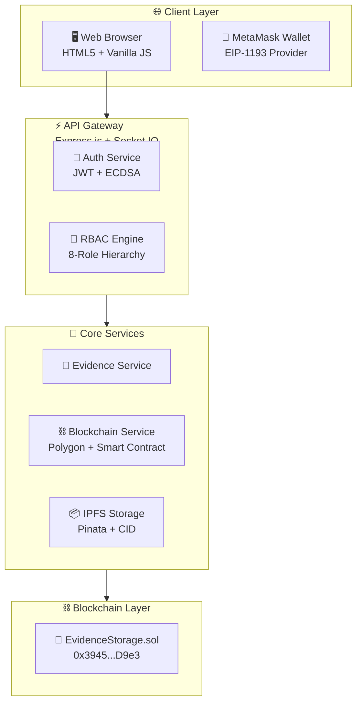
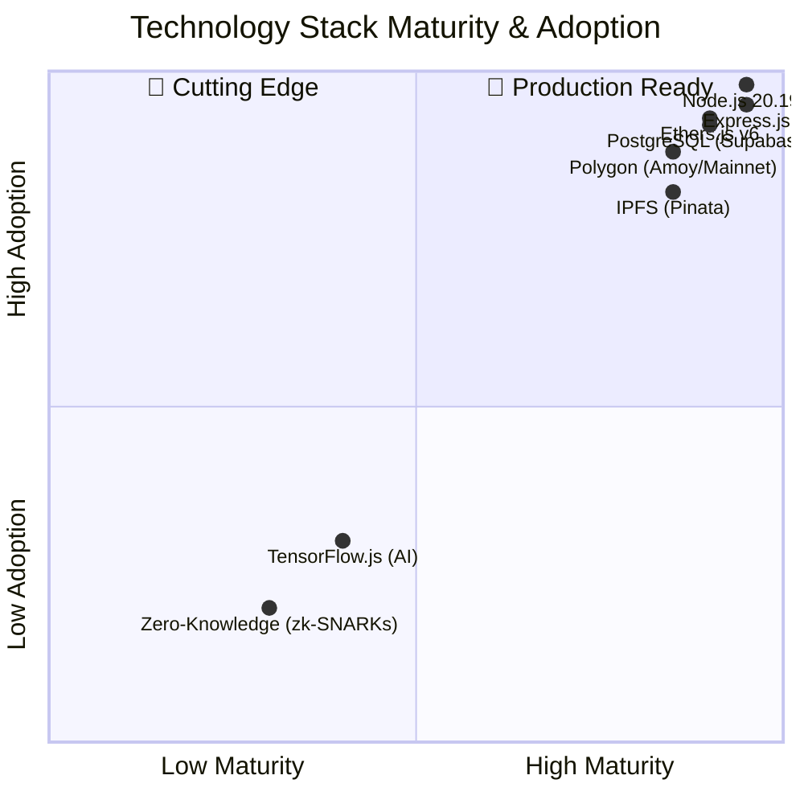
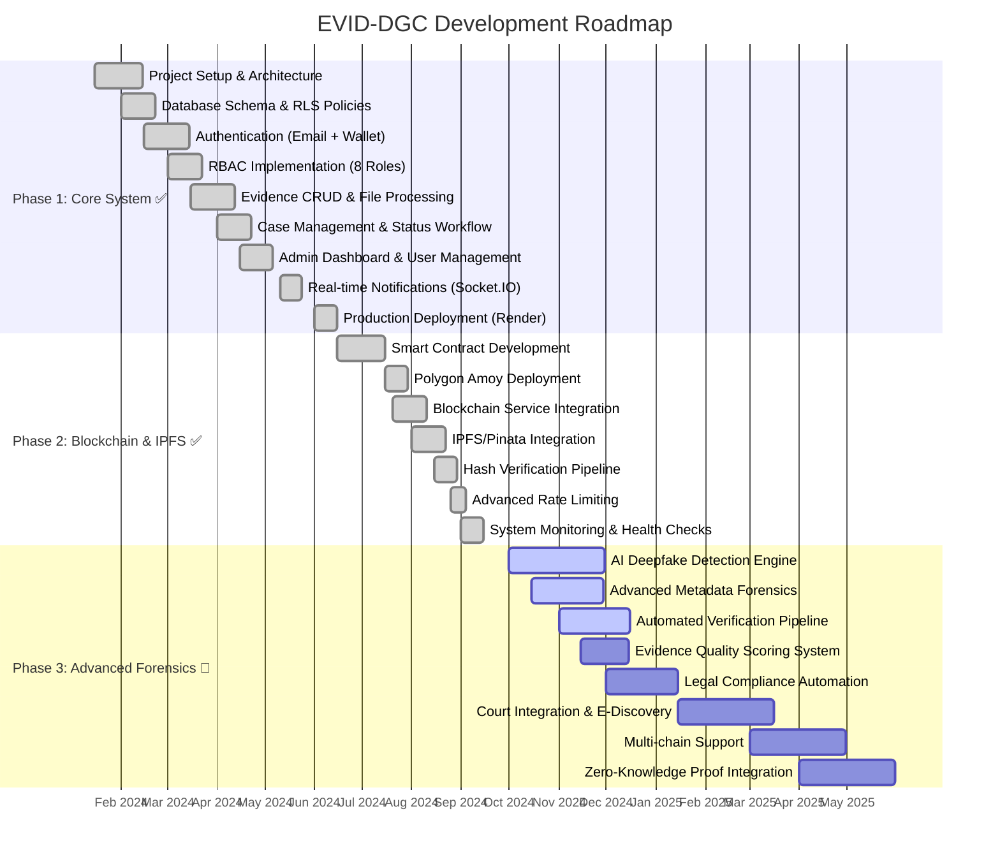
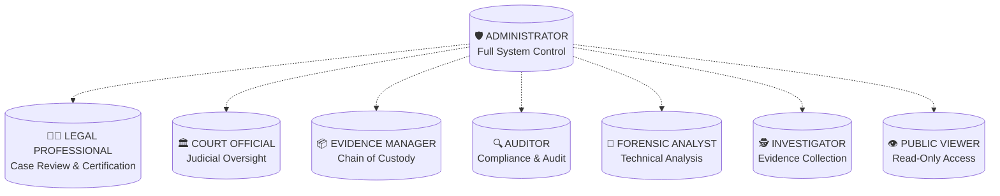
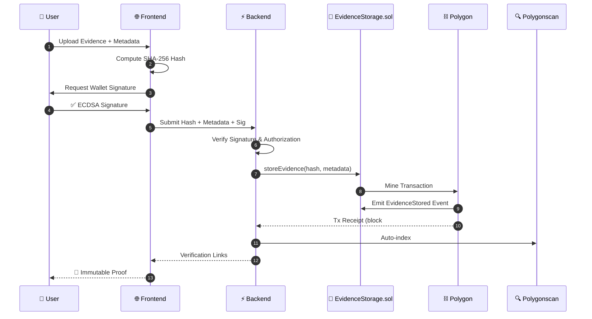
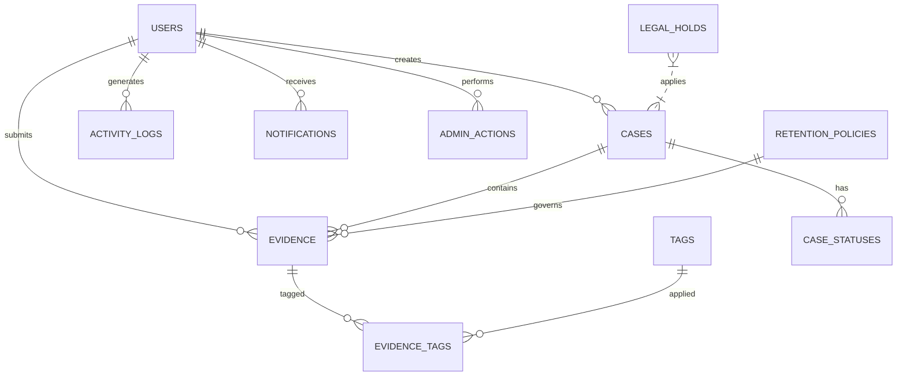

# 🔐 EVID-DGC - Blockchain Evidence Management System

<p align="center">
  <a href="https://github.com/Gooichand/blockchain-evidence">
    
  </a>
</p>

<p align="center">
  
</p>

<p align="center">
  <a href="#-quick-start"></a>
  <a href="#-architecture"></a>
  <a href="#-features"></a>
  <a href="#-documentation"></a>
  <a href="https://blockchain-evidence.onrender.com"></a>
</p>

<p align="center">
  
</p>

---


## 🎯 Problem & Solution

<table>
<tr>
<td width="50%" valign="top">

### ❌ The Problem
Digital evidence management faces critical challenges:

| Challenge | Impact |
|-----------|--------|
| **Data Tampering** | Evidence integrity cannot be proven |
| **Broken Chain of Custody** | No verifiable audit trail |
| **Inconsistent Access Control** | Unauthorized access risks |
| **Centralized Storage** | Single point of failure |
| **Opaque Processes** | Judicial bodies cannot verify integrity |

</td>
<td width="50%" valign="top">

### ✅ The Solution
**EVID-DGC** leverages blockchain & decentralized storage:

| Innovation | Benefit |
|------------|---------|
| **Polygon Blockchain** | Immutable transaction proof |
| **IPFS via Pinata** | Decentralized, censorship-resistant storage |
| **SHA-256 Hashing** | Cryptographic file fingerprints |
| **8-Role RBAC** | Granular, auditable permissions |
| **Real-time Notifications** | Instant team awareness |
| **Dual Auth (Wallet + Email)** | Flexible, secure access |

</td>
</tr>
</table>

---


## 🏗️ Architecture

<p align="center">
  
</p>

<details>
<summary><b>🔍 View Mermaid Source (Native GitHub Rendering)</b></summary>



</details>

### 📊 Technology Stack Maturity



---


## 🚀 Project Status

<p align="center">
  
  
  
</p>

### Development Roadmap



---


## ✨ Core Features

<p align="center">
  
</p>

### Phase 1: Core System (Production Ready)

| Feature | Description | Status |
|---------|-------------|--------|
| **8-Role RBAC** | Administrator, Investigator, Forensic Analyst, Legal Professional, Court Official, Evidence Manager, Auditor, Public Viewer | ✅ |
| **Dual Authentication** | MetaMask wallet (ECDSA) + Email/Password (bcrypt + JWT) | ✅ |
| **Admin Dashboard** | Full user management, role assignment, system configuration | ✅ |
| **Evidence Management** | Upload, watermark, compress, tag, verify, export | ✅ |
| **Case Lifecycle** | Draft → Open → Under Review → Court Ready → Closed/Archived | ✅ |
| **Audit Logging** | Immutable activity trails with IP, user agent, severity | ✅ |
| **Real-time WS** | Socket.IO notifications for uploads, verifications, assignments | ✅ |
| **Supabase + RLS** | PostgreSQL with Row Level Security policies | ✅ |

### Phase 2: Blockchain & IPFS (Production Ready)

| Feature | Description | Status |
|---------|-------------|--------|
| **Smart Contract** | `EvidenceStorage.sol` deployed to Polygon Amoy (`0x3945...D9e3`) | ✅ |
| **On-Chain Anchoring** | SHA-256 hash + metadata stored immutably | ✅ |
| **Gas Optimization** | Estimation, tracking, 2-block confirmation | ✅ |
| **IPFS Storage** | Pinata API, CID generation, gateway retrieval | ✅ |
| **Hash Verification** | `verifyHash()` against blockchain + IPFS content | ✅ |
| **Explorer Links** | Direct Polygonscan transaction/address URLs | ✅ |
| **Advanced Rate Limiting** | Blockchain: 10/min, Upload: 50/hr, Verify: 30/min | ✅ |
| **Health Monitoring** | Real-time blockchain, IPFS, database health checks | ✅ |

### Phase 3: Advanced Forensics (In Development)

| Feature | Description | Target |
|---------|-------------|--------|
| **AI Deepfake Detection** | TensorFlow.js + ONNX models for media authenticity | Q4 2024 |
| **Metadata Forensics** | EXIF, C2PA, hidden data extraction & analysis | Q4 2024 |
| **Auto Verification** | ML-powered evidence integrity scoring | Q1 2025 |
| **Quality Scoring** | Evidence reliability & completeness metrics | Q1 2025 |
| **Legal Compliance** | Automated GDPR, evidence retention, chain-of-custody | Q1 2025 |
| **Court Integration** | E-discovery APIs, digital exhibit packaging | Q2 2025 |
| **Multi-chain** | Ethereum, BSC, Arbitrum support | Q2 2025 |
| **Zero-Knowledge** | zk-SNARKs for private verification | Q3 2025 |

---


## 🔐 Role-Based Access Control (8 Roles)



### Permission Matrix

| Permission | Admin | Legal | Court | Manager | Auditor | Analyst | Investigator | Viewer |
|------------|-------|-------|-------|---------|---------|---------|--------------|--------|
| Upload Evidence | ✅ | ✅ | ❌ | ✅ | ❌ | ❌ | ✅ | ❌ |
| Download/Export | ✅ | ✅ | ✅ | ✅ | ✅ | ✅ | ✅ | ❌ |
| Verify Hash | ✅ | ✅ | ✅ | ✅ | ✅ | ✅ | ✅ | ✅ |
| Create Case | ✅ | ✅ | ❌ | ✅ | ❌ | ❌ | ✅ | ❌ |
| Manage Users | ✅ | ❌ | ❌ | ❌ | ❌ | ❌ | ❌ | ❌ |
| System Config | ✅ | ❌ | ❌ | ❌ | ❌ | ❌ | ❌ | ❌ |
| Legal Hold | ✅ | ✅ | ✅ | ✅ | ❌ | ❌ | ❌ | ❌ |
| Certify Evidence | ✅ | ✅ | ❌ | ❌ | ❌ | ❌ | ❌ | ❌ |
| Court Actions | ✅ | ❌ | ✅ | ❌ | ❌ | ❌ | ❌ | ❌ |
| AI Analysis | ✅ | ❌ | ❌ | ❌ | ❌ | ✅ | ❌ | ❌ |

---


## ⛓️ Blockchain Integration

### Smart Contract: `EvidenceStorage.sol`

```solidity
// SPDX-License-Identifier: MIT
pragma solidity ^0.8.19;

contract EvidenceStorage {
    struct Evidence {
        string fileHash;      // SHA-256
        string metadata;      // JSON string
        address uploadedBy;
        uint256 timestamp;
        bool isSealed;
    }
    
    mapping(uint256 => Evidence) public evidences;
    mapping(string => uint256) public hashToEvidenceId;
    mapping(address => bool) public authorizedUsers;
    
    event EvidenceStored(uint256 indexed evidenceId, string fileHash, address indexed uploadedBy);
    event EvidenceSealed(uint256 indexed evidenceId, address indexed sealedBy);
    
    function storeEvidence(string memory _fileHash, string memory _metadata) 
        public onlyAuthorized returns (uint256);
    function verifyHash(string memory _fileHash) public view returns (bool, uint256);
    function sealEvidence(uint256 _evidenceId) public onlyAuthorized;
}
```

**Deployed Address:** `0x39453ED8CF79Fe56150fe1E8348e75894e3dD9e3`  
**Network:** Polygon Amoy (Chain ID: 80002) / Mainnet (137)  
**Explorer:** [Polygonscan](https://amoy.polygonscan.com/address/0x39453ED8CF79Fe56150fe1E8348e75894e3dD9e3)

### Blockchain Transaction Flow



---


## 🌐 IPFS Decentralized Storage

| Component | Technology | Purpose |
|-----------|------------|---------|
| **Pinning Service** | Pinata API | Reliable, redundant pinning |
| **Content Addressing** | IPFS CID v1 | Immutable content identifiers |
| **Gateway** | `gateway.pinata.cloud/ipfs/` | Fast public retrieval |
| **Metadata** | JSON + keyvalues | Searchable file attributes |

**Features:**
- ✅ Automatic pinning on upload
- ✅ CID validation (v0/v1 support)
- ✅ Pin status monitoring
- ✅ Duplicate detection
- ✅ Unpin capability for retention compliance
- ✅ Gateway fallback URLs

---


## 📦 3D Evidence Model

<p align="center">
  <a href="assets/evidence-cube.stl">
    
  </a>
</p>

Interactive 3D evidence cube (STL format) - viewable natively on GitHub:

```stl
solid evidence_blockchain_cube
  facet normal 0.0 0.0 1.0
    outer loop
      vertex 0.0 0.0 10.0
      vertex 10.0 0.0 10.0
      vertex 10.0 10.0 10.0
    endloop
  endfacet
  ... (12 facets forming a cube)
endsolid evidence_blockchain_cube
```

**Click the badge above or [view the STL file](assets/evidence-cube.stl) directly on GitHub** to rotate, zoom, and inspect the 3D model.

---


## 🗄️ Database Schema (17+ Tables)



**Key Tables:**
- `users` — 8 roles, wallet/email auth, department, jurisdiction
- `evidence` — hash, IPFS CID, blockchain tx, block#, gas, seal status
- `cases` — status workflow, assignments, court dates, tags
- `activity_logs` — full audit trail with severity
- `admin_actions` — immutable admin operation log
- `notifications` — typed, expiring, real-time
- `tags` — hierarchical, categorizable, usage tracking

---


## ⚡ Quick Start

### Prerequisites
- **Node.js** v20.19+ 
- **npm** or **yarn**
- **MetaMask** browser extension
- **Supabase** account
- **Pinata** account (for IPFS)
- **Alchemy/Polygon RPC** (for blockchain)

### 1. Clone & Install
```bash
git clone https://github.com/Gooichand/blockchain-evidence.git
cd blockchain-evidence
npm install
```

### 2. Environment Setup
```bash
cp .env.example .env
# Edit .env with your credentials
```

**Required Variables:**
```env
SUPABASE_URL=your_supabase_url
SUPABASE_KEY=your_anon_key
JWT_SECRET=your_secure_secret
POLYGON_RPC_URL=https://rpc-amoy.polygon.technology
PRIVATE_KEY=your_wallet_private_key
CONTRACT_ADDRESS=0x39453ED8CF79Fe56150fe1E8348e75894e3dD9e3
PINATA_JWT=your_pinata_jwt
```

### 3. Database Setup
1. Go to [Supabase Dashboard](https://app.supabase.com)
2. Create project → SQL Editor
3. Run `complete-database-setup-fixed.sql`

### 4. Deploy Smart Contract (Optional)
```bash
npm run compile
npm run deploy:amoy
# Update CONTRACT_ADDRESS in .env
```

### 5. Start Development
```bash
npm run dev
# Server at http://localhost:3000
```

---


## 🧪 Testing

```bash
# Unit tests
npm test

# Integration tests
npm run test:integration

# Linting
npm run lint
npm run format:check
```

**Test Coverage:**
- Health endpoints
- Signature verification middleware
- Authentication flows
- Rate limiting
- Blockchain integration

---


## 📚 Documentation

| Guide | Description |
|-------|-------------|
| [User Guide](docs/USER_GUIDE.md) | Role-specific workflows |
| [Developer Guide](docs/DEVELOPER_GUIDE.md) | Architecture, APIs, contributing |
| [Security Guide](docs/SECURITY.md) | Threat model, best practices |
| [Deployment Guide](docs/DEPLOYMENT.md) | Render, Vercel, Netlify |
| [Maintenance Guide](docs/MAINTENANCE.md) | Backups, monitoring, updates |
| [API Reference](docs/swagger.js) | OpenAPI/Swagger documentation |

---


## 🚀 Deployment

### Render.com (Recommended)
```yaml
# render.yaml (included)
services:
  - type: web
    name: evid-dgc
    env: node
    buildCommand: npm install
    startCommand: npm start
    envVars:
      - key: NODE_ENV
        value: production
```

### Environment Variables (Production)
```env
NODE_ENV=production
PORT=10000
SUPABASE_URL=your_production_url
SUPABASE_KEY=your_production_key
# ... all other vars
```

### One-Click Deploy
[](https://render.com/deploy?repo=https://github.com/Gooichand/blockchain-evidence)

---


## 🤝 Contributing

We welcome contributions! See [CONTRIBUTING.md](CONTRIBUTING.md) for guidelines.

### Quick Contribution Steps
1. **Fork** the repository
2. **Create** a feature branch: `git checkout -b feature/amazing-feature`
3. **Commit** changes: `git commit -m 'Add amazing feature'`
4. **Push** to branch: `git push origin feature/amazing-feature`
5. **Open** a Pull Request

### Development Workflow
```bash
# Auto-regenerate diagrams on .mmd changes
# (Handled by GitHub Action)

# Run locally before PR
npm run lint:fix
npm run format
npm test
```

---


## 📄 License

**Apache License 2.0** — See [LICENSE](LICENSE) for details.

```
Copyright 2025 EVID-DGC Blockchain Evidence Management System

Licensed under the Apache License, Version 2.0 (the "License");
you may not use this file except in compliance with the License.
You may obtain a copy at http://www.apache.org/licenses/LICENSE-2.0
```

---


## 🙏 Acknowledgments

| Project | Purpose |
|---------|---------|
| [Polygon](https://polygon.technology/) | Scalable Ethereum L2 |
| [Pinata](https://pinata.cloud/) | IPFS pinning service |
| [Supabase](https://supabase.com/) | PostgreSQL + Auth + Realtime |
| [Ethers.js](https://ethers.org/) | Ethereum library |
| [Mermaid](https://mermaid.js.org/) | Diagrams as code |
| [Waveify](https://waveify.up.railway.app/) | Animated SVG banners |
| [Lucide](https://lucide.dev/) | Beautiful icons |

---

<p align="center">
  
</p>

<p align="center">
  <b>Built with ❤️ for Digital Forensic Integrity</b><br>
  <sub>Making evidence tamper-proof, verifiable, and court-ready</sub>
</p>

<p align="center">
  <a href="https://github.com/Gooichand/blockchain-evidence/stargazers">
    
  </a>
  <a href="https://github.com/Gooichand/blockchain-evidence/network/members">
    
  </a>
  <a href="https://github.com/Gooichand/blockchain-evidence/issues">
    
  </a>
</p>

<p align="center">
  <a href="#-evid-dgc---blockchain-evidence-management-system">⬆ Back to Top</a>
</p>