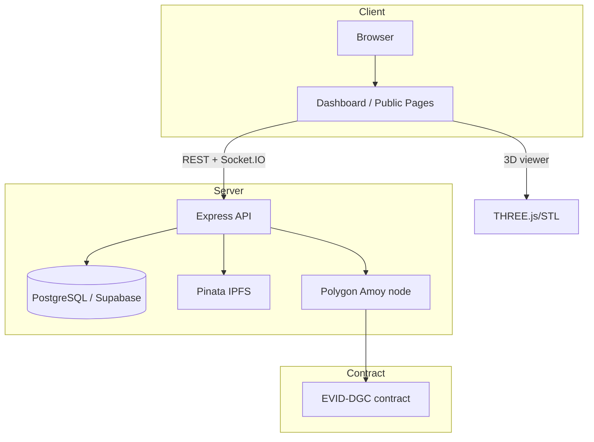
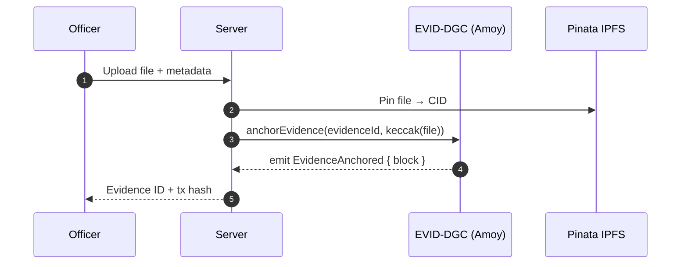
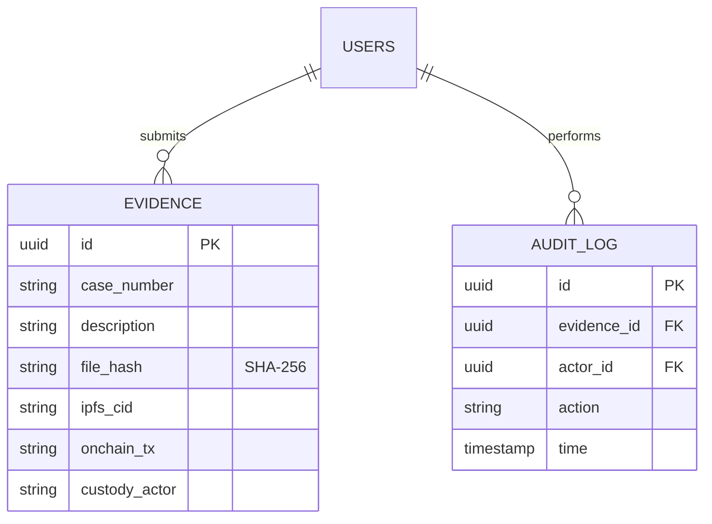
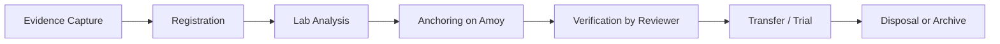

<div align="center">



# EVID-DGC — Blockchain Evidence & Digital Chain of Custody

[](https://github.com/Gooichand/blockchain-evidence)

<p align="center">
  
  
  
  
  
  
  
  
</p>

<p align="center">
  <a href="https://blockchain-evidence.onrender.com"></a>
  <a href="public/api-reference.html"></a>
  <a href="docs/DEPLOYMENT.md"></a>
</p>


</div>

---

## 📊 Live Repository Statistics

<div align="center">

[](https://github.com/Gooichand/blockchain-evidence)

[](https://github.com/Gooichand/blockchain-evidence)

</div>

---

## 📌 Current Status — August 2026

| Component | Status |
|---|---|
| **Core Platform (Phase 1)** | ✅ Live — [demo](https://blockchain-evidence.onrender.com) |
| **Blockchain Integration (Phase 2)** | ✅ Live on **Polygon Amoy testnet** |
| **IPFS Storage (Phase 2)** | ✅ Live via **Pinata** |
| **Forensic Lab (Phase 3)** | 🔶 In development — foundation shipped |
| **3D Evidence Viewer (Phase 3)** | 🔶 Viewer live (STL asset shipped), advanced controls planned |
| **AI-Assisted Analysis (Phase 3)** | 🔬 Research phase |
| **Mainnet Deployment (Phase 4)** | 🔴 Planned — currently Amoy only |

> [!IMPORTANT]
> **All blockchain records are on the Polygon Amoy testnet.** Production/mainnet
> anchoring is the Phase 4 target, not yet available.

---

## 🚨 The Problem

- **Broken chain of custody** in traditional evidence room handling
- **No public auditability** — evidence integrity only checkable by the court
- **Missing multi-hash verification** (MD5, SHA-1, SHA-256)
- **No immutability** — files can be silently modified

## 💡 Our Solution

- **8-role RBAC + ABAC enforcement** applies to every action
- **Blockchain anchoring on Polygon Amoy** — write the evidence hash, immutably
- **IPFS pinning via Pinata** — full file, permanent storage
- **Forensic Lab** — generates multiple hashes per evidence, highlights tamper
- **3D evidence model** — an STL digital twin of the evidence document

---

## 📦 Core Features

### Phase 1 — Core System ✅ Deployed
- 8 roles: Admin, Officer, Investigator, Analyst, Evidence Manager, Reviewer, Judge, Public
- Evidence create → register → store → transfer → verify lifecycle
- Audit logging of all custody events
- Real-time dashboard via **Socket.IO**
- Subordinate re-upload anti-tamper via **multi-hash comparison**

### Phase 2 — Blockchain & IPFS ✅ Deployed (Amoy)
- `EVID-DGC.sol` — `anchorEvidence`, `verifyEvidence`, `getEvidenceHistory`
- Won the chain (deployed address in [Deployment section](#deployment))
- Files pinned to **Pinata IPFS**, hash recorded on-chain

### Phase 3 — Forensic Lab & 3D Evidence 🔶 In Progress
- Forensic analyzer: **MD5 / SHA-1 / SHA-256**, entropy, file-type detection
- **3D Evidence Viewer** — STL model rendered in-app (asset: `assets/evidence-cube.stl`)
- Forensic report generator — planned
- AI-based evidence triage — research

---

## 🧰 Technology Stack

<!-- shields.io badges -->

<p align="center">
  
  
  
  
  
  
  
  
  
  
  
  
</p>

### Technology Stack Maturity

| Area | Maturity |
|---|---|
| Frontend / Backend | ✅ ✅ Mature — full page toolkit |
| Blockchain + IPFS | ✅ Operational — Amoy testnet |
| 3D evidence & AI | 🟡 Prototype / roadmap |
| Mainnet | ❌ Not deployed |

---

## 🏗️ Architecture



---

## 🧑‍⚖️ Role-Based Access Control (RBAC)

| Role | Permissions |
|---|---|
| **Admin** | Full system control, user/role management |
| **Officer** | Capture & register new evidence, upload files |
| **Investigator** | Access case data, annotate evidence |
| **Analyst** | Run forensic analysis on evidence |
| **Evidence Manager** | Manage evidence lifecycle & retention |
| **Reviewer** | Verify chain of custody, approve evidence |
| **Judge** | Review finalized reports, certify for trial |
| **Public** | Verify evidence integrity (public dashboard) |

ABAC rules enforce context: only the owning investigator/team may transfer
evidence; Public role is restricted to verification endpoints.

---

## ⛓️ Blockchain & Evidence Integrity

```solidity
// contracts/EVID_DGC.sol (simplified)
contract EVID_DGC {
    mapping(bytes32 => EvidenceRecord) public records;

    function anchorEvidence(
        string memory evidenceId,
        bytes32 evidenceHash,
        address officer
    ) external returns (bytes32) {
        record.evidenceHash = evidenceHash;  // SHA-256 of file
        emit EvidenceAnchored(evidenceId, evidenceHash, block.timestamp);
        return recordHash;
    }
}
```

**Deployed Address (Polygon Amoy):**

```
EVID-DGC: 0x39453ED8CF79Fe56150fe1E8348e75894e3dD9e3
Explorer : https://amoy.polygonscan.com/address/0x39453ED8CF79Fe56150fe1E8348e75894e3dD9e3
```

> [!caution]
> This is a **testnet** contract. Do not use for production evidence until Phase 4 mainnet deploy.

### On-Chain Evidence Flow



---

## 📁 IPFS Storage

- Files **pinned on Pinata IPFS** at upload time — permanent & deduplicated
- CID stored in PostgreSQL, hash stored on-chain
- Public-dashboard verification compares **stored file hash vs. on-chain hash**

---

## 🗄️ Database Schema (PostgreSQL via Supabase)



Full schema: `complete-database-setup-fixed.sql` (repo root).

---

## 🔬 Evidence Workflow — Digital Chain of Custody



| Step | Actor | Output |
|---|---|---|
| Capture | Officer | File + metadata |
| Register | Evidence Manager | Evidence ID |
| Analyze | Analyst | Forensic report |
| Anchor | System | Hash 0x + txid |
| Verify | Reviewer / Public | Certified copy |

---

## 🧊 3D Evidence Viewer (Phase 3, in progress)

A genuine 3D model asset is included: [`assets/evidence-cube.stl`](assets/evidence-cube.stl).
The interactive viewer (`view-evidence3d.html`) renders it with notes/rotation;
miniature interactive application elements (e.g., adjustable lighting) are **planned**.

---

## 🧪 Testing

### Unit / Integration (Jest, Phase 1-2)

```bash
npm test          # unit + integration
npm run test:e2e  # Playwright E2E (planned configuration in progress)
```

### What's covered

- Evidence CRUD multi-hash detection
- Auth + RBAC role gating
- IPFS & chain mocks

---

## 🚀 Quick Start

### 1. Prerequisites

- Node.js 18+, npm
- Supabase project (or `docker run postgres`)
- (Optional) Pinata account + JWT

### 2. Clone & install

```bash
git clone https://github.com/Gooichand/blockchain-evidence.git
cd blockchain-evidence
npm install
```

### 3. Configure environment

```bash
cp .env.example .env
```

| Variable | Example |
|---|---|
| `SUPABASE_URL` | `https://xyz.supabase.co` |
| `SUPABASE_ANON_KEY` | `eyJ...` |
| `JWT_SECRET` | any (use pwgen) |
| `POLYGON_RPC_URL` | `https://rpc-amoy.polygon.technology` |
| `PRIVATE_KEY` | wallet key (Amoy test faucet) |
| `CONTRACT_ADDRESS` | `0x39453ED8CF79Fe56150fe1E8348e75894e3dD9e3` |
| `PINATA_JWT` | your Pinata JWT |

### 4. Run locally

```bash
npm run dev
# http://localhost:3000
```

Seed the DB first with `complete-database-setup-fixed.sql` (creates 8 roles &
demo users).

---

## 🌐 Public Evidence Verification (No Login)

Anyone can enter an **Evidence ID, SHA-256 hash, or on-chain tx hash** on the
[**Public Dashboard**](https://blockchain-evidence.onrender.com/dashboard-public.html)
and receive **VERIFIED ✅ / TAMPERED ❌** instantly — cross-checked against
PostgreSQL, the Amoy ledger, and IPFS.

---

## 📚 Documentation

- [`docs/API.md`](docs/API.md) – REST endpoints
- [`docs/DEPLOYMENT.md`](docs/DEPLOYMENT.md) – Render + PostgreSQL setup
- [`docs/SECURITY.md`](docs/SECURITY.md) – security model & checklist
- [`PHASES.md`](PHASES.md) – phases, roadmap, status
- [`CONTRIBUTING.md`](CONTRIBUTING.md) – how to contribute

---

## 📄 Deployment — Render One-Click

[](https://render.com/deploy?repo=https://github.com/Gooichand/blockchain-evidence)

`render.yaml` provisions the web service + managed PostgreSQL.

---

## 🤝 Contributing

See [`CONTRIBUTING.md`](CONTRIBUTING.md) — issues welcomed, PRs reviewed.
Help wanted tags: `3d-viewer`, `ai-analysis`, `mainnet`.

---

## 📝 License

**MIT** — see [`LICENSE`](LICENSE). © 2025-2026 **EVID-DGC**.

---

## 🙌 Acknowledgments

- [Pinata](https://www.pinata.cloud) for IPFS pinning
- [Polygon](https://polygon.technology) Amoy testnet
- [Render](https://render.com) hosting
- [Supabase](https://supabase.com) PostgreSQL + Auth
- GitHub Actions for CI status badge

---

<div align="center">

  

  <br>

  <h3>⚖️ EVID-DGC — Immutably anchored. Forever provable.</h3>

  <p>
    <a href="https://github.com/Gooichand/blockchain-evidence"></a>
    <a href="https://blockchain-evidence.onrender.com"></a>
    <a href="mailto:gc67766@gmail.com"></a>
  </p>

  <p>
    <a href="#blockchain-evidence--digital-chain-of-custody"></a>
  </p>

  <p>⭐ If you find this project useful, **give it a star**!</p>

  <sub>© 2025-2026 EVID-DGC · Immutably anchored. Forever provable. ⚖️</sub>

</div>