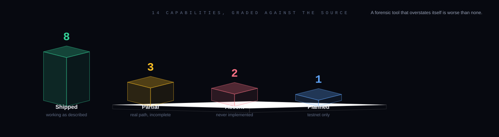
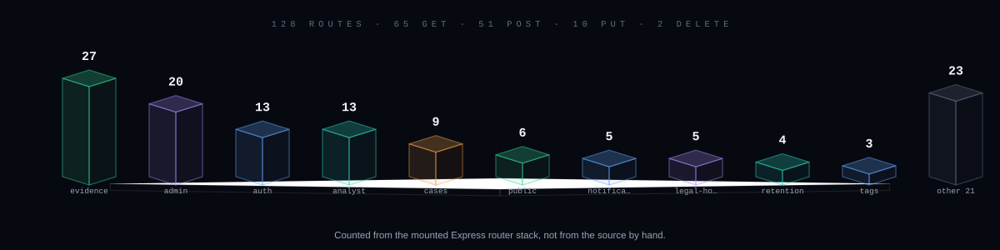

<div align="center">
  

  <h1>EVID-DGC</h1>
  <p><strong>Tamper-evident digital evidence management.</strong></p>
  <p>Hash on ingest &rarr; pin to IPFS &rarr; anchor the digest on-chain &rarr; let anyone prove the file is byte-for-byte what it was at collection.</p>

  <p>
    <a href="#quick-start"><strong>Quick start</strong></a> &nbsp;&middot;&nbsp;
    <a href="#pipeline">Pipeline</a> &nbsp;&middot;&nbsp;
    <a href="#reality-check">Reality check</a> &nbsp;&middot;&nbsp;
    <a href="#architecture">Architecture</a> &nbsp;&middot;&nbsp;
    <a href="#security">Security</a> &nbsp;&middot;&nbsp;
    <a href="#known-gaps">Known gaps</a>
  </p>

  <p>
    <a href="https://github.com/Gooichand/blockchain-evidence/actions/workflows/ci.yml"></a>
    <a href="LICENSE"></a>
    =20.19" src="https://img.shields.io/badge/node-%5E20.19%20%7C%7C%20%3E%3D22-3c873f.svg">
    
  </p>
</div>

<br>

> [!WARNING]
> **Testnet build, stated plainly.** All anchoring targets **Polygon Amoy**
> (chainId `80002`) — not economically final, contract unaudited. Anchoring also
> needs the signer authorised in the contract's `authorizedUsers` map; until it
> is, anchor transactions revert and uploads store with a warning. Not fit for
> production evidence yet.

---

## The one guarantee

<div align="center">

| | |
|---|---|
|  | |

</div>

A custody log in a database is only as trustworthy as whoever can write to that
database — usually the people you are auditing. EVID-DGC removes the trust
requirement from **one** claim: *the bytes of this file have not changed since
collection.* Everything else here is conventional application work on top of it.

---

## Pipeline

<div align="center">
  
</div>

Orchestrated in [`services/integratedEvidenceService.js`](services/integratedEvidenceService.js).
Verification is the mirror: re-fetch from IPFS, recompute SHA-256, compare.

Steps 2 and 3 are wrapped so an **IPFS or chain failure does not fail the
upload** — the error is recorded and the row still saves. For a forensic system
you should decide deliberately whether that is the policy you want.

---

## Reality check

<div align="center">
  
</div>

A forensic tool that overstates itself is worse than no tool at all, so this is
graded against the source.

| | | |
|---|---|---|
| **8 shipped** | RBAC · on-chain anchoring · IPFS pinning · SHA-256 verify · watermarked export · legal holds & retention · EIP-191 signing · upload | |
| **3 partial** | Forensic workbench (**only the SHA-256 engine is real** — 11 of 12 return `"under development"`) · public hash verification (DB lookup, no ledger check) · Socket.IO (server rooms, no browser client) | |
| **2 absent** | MFA / 2FA (columns exist, no code path) · 3D evidence viewer (never built) | |
| **1 planned** | Mainnet — Amoy testnet only | |

Full ledger with file and line: [Known gaps](#known-gaps).

---

## Architecture

<div align="center">
  
</div>

<div align="center">
  
</div>

```
server.js       Express 5 · Socket.IO · helmet/CORS · page guards
routes/         19 routers · 128 endpoints
controllers/    request handling and business rules
services/
  integratedEvidenceService.js   hash → IPFS → chain → DB
  blockchain/blockchainService.js ethers v6 + contract ABI
  storage/ipfsStorageService.js  Pinata pin / fetch / CID check
  evidenceHelpers.js             watermarking (sharp, pdf-lib)
  publicSchema.js                feature-detects optional migrations
middleware/
  authorization.js    8 roles · PROTECTED_PAGES · token revocation
  verifySignature.js  EIP-191 with replay protection
  requireAuth.js      JWT / x-user-wallet, re-reads the user row
contracts/            EvidenceStorage.sol + ABI
migrations/           8 additive SQL migrations
tests/                3 Jest suites · 17 tests
```

**Roles.** `admin`, `public_viewer`, `investigator`, `forensic_analyst`,
`legal_professional`, `court_official`, `evidence_manager`, `auditor` — each
served its own dashboard and scoped routers, re-read from the database on every
request and never trusted from the client.

**Contract.** `EvidenceStorage` stores `(fileHash, metadata, uploadedBy,
timestamp, isSealed)` with a reverse `hash → id` index, a duplicate-hash guard
and an `onlyAuthorized` modifier. Records are **write-once**: no update or
delete function exists. The hash is a `string`, not `bytes32`.

---

## Security

Enforced: helmet with a hand-written CSP · CORS allowlist with credentials ·
**bcrypt** + JWT in an `HttpOnly`, `SameSite=Lax` cookie with a server-side
revocation list · **EIP-191 request signing** (nonce, ±5 min window, method and
path binding, replay cache) · page guards that run *before* `express.static`, so
an unauthorised request never receives the HTML · `verifyAdmin` on all 18 admin
routes, re-checking the role against the database rather than trusting
`req.body` · rate limiting on auth, admin, upload, verification, analyst and
global routes · 50 MB body caps, 17-entry MIME allowlist, 100 MB upload cap ·
audit logging on auth, download, custody and admin events · immutability
on-chain by construction.

Stated limits are in the figure above, and in
[`docs/SECURITY.md`](docs/SECURITY.md) at length. The one to act on first: the
**base RLS is permissive** (`evidence` and `cases` are `SELECT USING (true)`), so
anyone holding the anon key can read all evidence until you run
`security-hardening.sql`.

---

## Quick start

```bash
git clone https://github.com/Gooichand/blockchain-evidence.git
cd blockchain-evidence
npm install
cp .env.example .env      # then fill it in
npm start                 # http://localhost:3000
```

Node **`^20.19.0 || >=22.0.0`** — the Express 5 / Hardhat toolchain will not run
on 18 or 16. `npm run dev` is the same server under `nodemon`.

<details>
<summary><b>Database setup</b></summary>

The backend talks to **Supabase (Postgres)**. There is no bundled database.

> [!CAUTION]
> [`complete-database-setup-fixed.sql`](complete-database-setup-fixed.sql) issues
> `DROP TABLE … CASCADE` on all 16 base tables. Run it **once**, on an empty
> project. Never point it at a database you care about.

```bash
# 1. Supabase SQL editor — base schema, roles, RLS, seed reference data
# 2. Then the additive migrations, in order:
migrations/add-blockchain-columns.sql
migrations/add-admin-control-center.sql
migrations/add-analysis-module.sql
migrations/add-production-features.sql
migrations/add-public-portal-columns.sql
migrations/add-users-email-verification-columns.sql
migrations/fix-case-id-types.sql
migrations/fix-session-columns.sql
# 3. Strongly recommended — replaces the permissive base RLS
security-hardening.sql
```

The base script seeds demo users whose `password_hash` values are **not bcrypt
hashes, so none of them can log in**. Register a real account instead; `admin` is
deliberately blocked from self-registration.

</details>

<details>
<summary><b>Configuration</b></summary>

`.env.example` is a starting point, not a specification — eight of its variables
(`BLOCKCHAIN_NETWORK`, `ENABLE_BLOCKCHAIN`, `ENCRYPTION_KEY`, `MAX_FILE_SIZE`,
`UPLOAD_PATH`, `LOG_LEVEL`, `LOG_FILE`, `TARGET_CHAIN_ID`) are **never read by any
code**.

| Variable | Required | Purpose |
|---|---|---|
| `SUPABASE_URL` | yes | Project URL. The process exits without it |
| `SUPABASE_KEY` | yes | Supabase **anon** key — named `SUPABASE_KEY`, *not* `SUPABASE_ANON_KEY` |
| `JWT_SECRET` | yes | Signs session tokens |
| `POLYGON_RPC_URL` | for chain | JSON-RPC endpoint for ethers v6 and Hardhat |
| `PRIVATE_KEY` | for chain | Signing key for anchor transactions |
| `CONTRACT_ADDRESS` | for chain | Deployed `EvidenceStorage` address |
| `PINATA_JWT` | for IPFS | The only Pinata credential used; `PINATA_API_KEY` / `PINATA_SECRET_KEY` are read but unused |
| `PORT` | no | Defaults to `3000` |
| `REDIS_URL` | no | Falls back to an in-memory cache, 60 s TTL |
| `SMTP_*` | no | Contact form only; endpoint returns `503` when unset |
| `ALLOWED_ORIGINS` | no | Extra CORS origins, comma-separated |
| `RATE_LIMIT_*` | no | Twelve knobs present in code, absent from `.env.example` |

Chain config lives in [`hardhat.config.js`](hardhat.config.js) and supports
`sepolia`, `polygonAmoy`, `polygon`. Deploy with `npm run deploy:amoy` /
`npm run deploy:polygon`.

</details>

<details>
<summary><b>Testing &amp; deployment</b></summary>

```bash
npm test                  # 3 suites · 17 tests — fully offline
npm run lint              # eslint
npm run test:integration  # live HTTP; needs a running server, funded wallet, valid Pinata JWT
```

Jest is offline by design: Supabase is mocked in `auth.test.js`, and
`health.test.js` drives the imported app through supertest without binding a
port. **There is no end-to-end or browser suite, and no Solidity tests.**

[`render.yaml`](render.yaml) declares a single Node web service with a
`/api/health` check. Postgres is Supabase and must be provisioned separately.
The blueprint sets only `NODE_ENV`, `PORT`, `SUPABASE_URL`, `SUPABASE_KEY` and
`ALLOWED_ORIGINS` — so `JWT_SECRET`, `PINATA_JWT`, `POLYGON_RPC_URL`,
`PRIVATE_KEY` and `CONTRACT_ADDRESS` must be added by hand, meaning **chain and
IPFS features are inert on a fresh deploy until you do**.

CI ([`.github/workflows/ci.yml`](.github/workflows/ci.yml)) runs on Node 20 and
gates on `npm run lint` and `npm test`. ESLint treats `no-unused-vars` and
`prettier/prettier` as warnings, so the lint gate is advisory. The contract is
not compiled and no coverage is collected.

[`docs/DEPLOYMENT.md`](docs/DEPLOYMENT.md) instructs `Node 16.x`, which is wrong
and will not work.

</details>

---

## Known gaps

Every item confirmed by reading the source. None speculative.

| Issue | Location |
|---|---|
| Chain anchoring reverts `"Not authorized"` until the signer is authorised via `authorizeUser` | deployment, not code |
| `retention_policies` queried five times; no SQL in this repo creates the table | `controllers/retentionController.js` |
| `security_alerts` never written by any code path, so the admin Action Center is always empty | `add-admin-control-center.sql:428` |
| `bull` and `node-cron` installed and never imported — **no job queue, no scheduler** | `package.json` |
| 4 of 10 rate limiters defined but applied to zero routes | `middleware/rateLimiters.js` |
| `EvidenceStorage.abi.json` omits `sealEvidence` and `deauthorizeUser` | `contracts/` |
| `evidence.case_id` is `TEXT` holding a case *number*, with no FK to `cases` | `complete-database-setup-fixed.sql` |
| `npm run health`, `blockchain:status`, `blockchain:health` probe port `10000`, server defaults to `3000` | `package.json` |
| `POST /api/evidence/archive` takes `archivedBy` from the request body | `controllers/retentionController.js:497` |
| Public verification returns `verified: true` without consulting the ledger | `controllers/EvidenceVerificationController.js:330` |
| `generateMockIPFSHash` / `generateMockTxHash` fabricate plausible CIDs and hashes | `services/evidenceHelpers.js:66` |
| 20 orphaned scripts in `public/` loaded by no page, including both 2FA modules | `public/` |
| `forensic-lab.html` is in `PROTECTED_PAGES` but the file does not exist | `middleware/authorization.js:84` |
| `docs/swagger.js` requires `swagger-jsdoc` and `swagger-ui-express`, neither installed | `docs/swagger.js` |

Contributions that close these are welcome — see
[`docs/MAINTENANCE.md`](docs/MAINTENANCE.md).

---

## Documentation

| Document | |
|---|---|
| [`docs/USER_GUIDE.md`](docs/USER_GUIDE.md) | Using the application |
| [`docs/DEVELOPER_GUIDE.md`](docs/DEVELOPER_GUIDE.md) | Architecture and API conventions |
| [`docs/MAINTENANCE.md`](docs/MAINTENANCE.md) | Routine upkeep |
| [`docs/DEPLOYMENT.md`](docs/DEPLOYMENT.md) | Deployment |
| [`docs/SECURITY.md`](docs/SECURITY.md) | Security model |
| `public/api-reference.html` | Served at `/api-reference.html`. Hand-written, not fully synced with the routers — prefer `routes/` |

---

## Contributing to the figures

The artwork is generated, not hand-drawn, so it stays consistent and
reproducible:

```bash
npm run assets:readme     # regenerate the SVGs (seeded — byte-identical each run)
npm run verify:readme     # assert every number in the figures against the source
npm run check:svg         # structural + geometry validation of the figures
```

## License

Apache-2.0 — see [`LICENSE`](LICENSE).

`contracts/EvidenceStorage.sol` is MIT licensed, per its SPDX header.