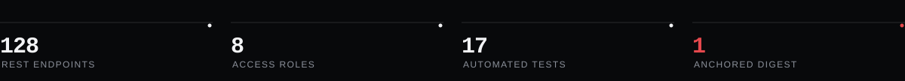
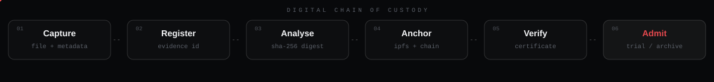

<div align="center">
  

  <h1>EVID-DGC</h1>
  <p><strong>Tamper-evident digital evidence management.</strong></p>
  <p>Hash on ingest &rarr; pin to IPFS &rarr; anchor the digest on-chain &rarr; let anyone prove the file is byte-for-byte what it was at collection.</p>

  <p>
    <a href="#quick-start"><strong>Quick start</strong></a> &nbsp;&middot;&nbsp;
    <a href="#how-it-works">How it works</a> &nbsp;&middot;&nbsp;
    <a href="#what-actually-works">What actually works</a> &nbsp;&middot;&nbsp;
    <a href="#architecture">Architecture</a> &nbsp;&middot;&nbsp;
    <a href="#security">Security</a> &nbsp;&middot;&nbsp;
    <a href="#known-gaps">Known gaps</a>
  </p>

  <p>
    <a href="https://github.com/Gooichand/blockchain-evidence/actions/workflows/ci.yml"></a>
    <a href="LICENSE"></a>
    =20.19" src="https://img.shields.io/badge/node-%5E20.19%20%7C%7C%20%3E%3D22-3c873f.svg">
    
  </p>
</div>

<br>

> [!WARNING]
> **This is a testnet build, and it is honest about it.** All anchoring targets
> **Polygon Amoy** (chainId `80002`) — not economically final, and the contract
> is unaudited. On-chain anchoring additionally requires the configured signer
> to be authorised in the contract's `authorizedUsers` map; until it is, anchor
> transactions revert and uploads are stored with a warning rather than being
> anchored. Nothing here is fit for production evidence yet. See
> [What actually works](#what-actually-works).

<div align="center">
  
</div>

---

## The problem

Evidence handling is a trust problem before it is a technology problem. A
custody log in a database is only as trustworthy as whoever can write to that
database — which, in most deployments, includes the people you are trying to
audit.

EVID-DGC removes the trust requirement from one specific claim: **the bytes of
this file have not changed since the moment they were collected.** It does that
by pushing a SHA-256 digest onto a public ledger, where altering it would
require rewriting a block that thousands of unrelated parties already hold.

Everything else in this repository — roles, cases, legal holds, retention,
forensics — is conventional application work sitting on top of that one
guarantee.

## How it works

<div align="center">
  
</div>

The real orchestration lives in
[`services/integratedEvidenceService.js`](services/integratedEvidenceService.js):

1. **Hash** the uploaded buffer with SHA-256.
2. **Pin** the file to IPFS via Pinata — content-addressed, so the CID *is* a
   content commitment. Retried three times with linear backoff.
3. **Anchor** the digest on-chain via `EvidenceStorage.storeEvidence`, waiting
   for 2 confirmations.
4. **Record** the row plus an `activity_logs` audit entry.

Worth knowing: steps 2 and 3 are wrapped so that **an IPFS or chain failure does
not fail the upload** — the error is recorded in `results.errors` and the record
still saves. For a forensic system you should decide deliberately whether that
is the policy you want.

Verification is the mirror image: re-fetch from IPFS, recompute SHA-256, compare.

## What actually works

Verified against source, not against a roadmap. A forensic tool that overstates
its own capability is worse than no tool at all, so this table is the honest
one.

| Capability | State | Detail |
|---|---|---|
| Role-based access control | **Shipped** | 8 roles; page guards enforced *before* `express.static`; role-scoped routers |
| On-chain anchoring | **Shipped** | [`contracts/EvidenceStorage.sol`](contracts/EvidenceStorage.sol) on Amoy via ethers v6 |
| IPFS pinning | **Shipped** | Pinata, pinned at upload, with retry and CID validation |
| SHA-256 verification | **Shipped** | Real digest; integrity re-check path re-downloads from IPFS |
| Watermarked export | **Shipped** | `sharp` + `pdf-lib` for images and PDFs, plus ZIP bulk export |
| Legal holds & retention | **Shipped** | Full CRUD, per-item hold, admission status, policy timeline |
| EIP-191 request signing | **Shipped** | Nonce + ±5 min timestamp + method/path binding + replay cache |
| Forensic workbench | **Partial** | 12-tool UI; **only the SHA-256 engine is real** — 11 return `"under development"` |
| Public hash verification | **Partial** | Database lookup only; does not re-check the ledger yet |
| Realtime notifications | **Partial** | Socket.IO rooms exist server-side; the browser client does not |
| MFA / 2FA | **Absent** | Columns exist in the schema, no code path uses them |
| 3D evidence viewer | **Absent** | Never implemented. `assets/evidence-cube.stl` is a placeholder cube referenced by nothing |
| Evidence upload | **Shipped** | Hash → IPFS pin → on-chain anchor → DB row, via `integratedEvidenceService` |
| Mainnet deployment | **Planned** | Amoy testnet only |

The full ledger of defects, with file and line, is in
[Known gaps](#known-gaps).

## Quick start

```bash
git clone https://github.com/Gooichand/blockchain-evidence.git
cd blockchain-evidence
npm install
cp .env.example .env      # then fill it in — see Configuration
npm start                 # http://localhost:3000
```

Requires **Node `^20.19.0 || >=22.0.0`** — the Express 5 / Hardhat toolchain will
not run on Node 18 or 16.

`npm run dev` starts the same server under `nodemon`.

### Database

The backend talks to **Supabase (Postgres)**. There is no bundled database.

> [!CAUTION]
> [`complete-database-setup-fixed.sql`](complete-database-setup-fixed.sql) issues
> `DROP TABLE … CASCADE` against all 16 base tables. It is meant to be run
> **once**, on an empty project. Never point it at a database you care about.

```bash
# 1. In the Supabase SQL editor — base schema, roles, RLS, seed reference data
# 2. Then apply the additive migrations, in order:
migrations/add-blockchain-columns.sql
migrations/add-admin-control-center.sql
migrations/add-analysis-module.sql
migrations/add-production-features.sql
migrations/add-public-portal-columns.sql
migrations/add-users-email-verification-columns.sql
migrations/fix-case-id-types.sql
migrations/fix-session-columns.sql
# 3. Strongly recommended — replaces the permissive base RLS policies
security-hardening.sql
```

The base script seeds `case_statuses` and `tags`, and creates demo users — but
**their `password_hash` values are not bcrypt hashes, so none of them can log
in.** Create your first real account through the registration flow instead.
`admin` is deliberately blocked from self-registration.

## Configuration

`.env.example` is a starting point, not a specification. Eight of the variables
in it are **never read by any code** — `BLOCKCHAIN_NETWORK`,
`ENABLE_BLOCKCHAIN`, `ENCRYPTION_KEY`, `MAX_FILE_SIZE`, `UPLOAD_PATH`,
`LOG_LEVEL`, `LOG_FILE`, `TARGET_CHAIN_ID`. Setting them does nothing.

These are the ones that matter:

| Variable | Required | Purpose |
|---|---|---|
| `SUPABASE_URL` | yes | Supabase project URL. The process exits without it |
| `SUPABASE_KEY` | yes | Supabase **anon** key — note the name is `SUPABASE_KEY`, not `SUPABASE_ANON_KEY` |
| `JWT_SECRET` | yes | Signs session tokens |
| `POLYGON_RPC_URL` | for chain | JSON-RPC endpoint used by ethers v6 and Hardhat |
| `PRIVATE_KEY` | for chain | Signing key for anchor transactions |
| `CONTRACT_ADDRESS` | for chain | Deployed `EvidenceStorage` address |
| `PINATA_JWT` | for IPFS | The only Pinata credential actually used; `PINATA_API_KEY` / `PINATA_SECRET_KEY` are read but unused |
| `PORT` | no | Defaults to `3000` |
| `REDIS_URL` | no | Falls back to an in-memory cache with a 60 s TTL |
| `SMTP_HOST` / `SMTP_PORT` / `SMTP_USER` / `SMTP_PASS` | no | Contact form only; the endpoint returns `503` when unset |
| `ALLOWED_ORIGINS` | no | Comma-separated extra CORS origins |
| `RATE_LIMIT_*_WINDOW_MS` / `RATE_LIMIT_*_MAX` | no | Twelve rate-limit knobs that exist in code but are missing from `.env.example` |

Chain config lives in [`hardhat.config.js`](hardhat.config.js) and supports
`sepolia`, `polygonAmoy`, and `polygon`. Deployment of the contract is
`npm run deploy:amoy` / `npm run deploy:polygon`.

## Architecture

```
server.js                  Express 5 app, Socket.IO, helmet/CORS, page guards
routes/                    19 routers · 128 endpoints
controllers/               Request handling and business rules
services/
  integratedEvidenceService.js   hash → IPFS → chain → DB orchestration
  blockchain/blockchainService.js ethers v6 + contract ABI
  storage/ipfsStorageService.js  Pinata pin / fetch / CID validation
  evidenceHelpers.js             watermarking (sharp, pdf-lib)
  notificationService.js         DB rows + Socket.IO emit
  publicSchema.js                feature-detects optional migrations
  monitoringService.js           read-only metrics and thresholds
  web3Service.js, ipfsService.js legacy duplicates, used only by a migration script
middleware/
  authorization.js         8 roles, PROTECTED_PAGES, token revocation
  verifySignature.js       EIP-191 verification with replay protection
  requireAuth.js           JWT / x-user-wallet, re-reads the user row
  rateLimiters.js          10 limiters (6 are actually wired to routes)
contracts/                 EvidenceStorage.sol + ABI
migrations/                8 additive SQL migrations
public/                    46 static pages
tests/                     3 Jest suites · 17 tests
```

**Roles.** Eight, defined in `middleware/authorization.js`:
`admin`, `public_viewer`, `investigator`, `forensic_analyst`,
`legal_professional`, `court_official`, `evidence_manager`, `auditor`.
Each is served its own dashboard and scoped routers. Roles are re-read from the
database on every request — never trusted from the client.

**Contract.** `EvidenceStorage` stores `(fileHash, metadata, uploadedBy,
timestamp, isSealed)` with a reverse `hash → id` index, a duplicate-hash guard,
and an `onlyAuthorized` modifier. Records are **write-once**: there is no update
or delete function. The hash is a `string`, not `bytes32`.

## Security

Genuinely implemented:

- **Helmet** with a hand-written CSP, and a CORS allowlist with credentials
- **bcrypt** password hashing; **JWT** in an `HttpOnly`, `SameSite=Lax` cookie
  with a server-side revocation list
- **EIP-191 request signing** — nonce, ±5 minute timestamp window, method and
  path binding, and an in-memory replay cache
- **Server-side page guards** that run *before* static file serving, so an
  unauthorised request never receives the HTML
- **`verifyAdmin`** on all 18 admin routes, which re-checks the role against the
  database instead of trusting `req.body`
- Rate limiting on auth, admin, upload, verification, analyst and global API
  routes; 50 MB body caps; a 17-entry MIME allowlist and 100 MB size cap on
  uploads; audit logging on auth, download, custody and admin events
- Immutability by construction on-chain

Known limits, stated plainly:

- The **base RLS is permissive** — `evidence` and `cases` are
  `SELECT USING (true)`, and `users` has `INSERT WITH CHECK (true)`. Anyone
  holding the anon key can read all evidence until you run
  `security-hardening.sql`.
- The CSP allows `'unsafe-inline'` for scripts and attributes.
- The auth rate limiter sets `skipFailedRequests: true`, so **failed logins do
  not consume the quota**, and its default is 100 requests / 15 minutes.
- A raw `PRIVATE_KEY` lives in the server process and signs transactions.
  No KMS, no rotation.
- Nonce, revocation and connected-user state are held **in process memory** —
  they do not survive a restart and are not shared across instances.
- `POST /api/evidence/archive` trusts an `archivedBy` value from the request
  body under optional auth.

See [`docs/SECURITY.md`](docs/SECURITY.md) for the longer version.

## Testing

```bash
npm test                  # 3 suites · 17 tests — fully offline
npm run lint              # eslint
npm run test:integration  # live HTTP against a running server
```

The Jest suite is offline by design: Supabase is mocked in `auth.test.js`, and
`health.test.js` drives the imported Express app through supertest without
binding a port. It covers auth flows, health/404/catch-all behaviour, and
signature verification.

`test:integration` is different — it needs a running server, a funded wallet and
a valid Pinata JWT, because it performs a real upload and asserts a real
transaction hash.

There is **no end-to-end or browser suite**, and no Solidity tests.

## Deployment

[`render.yaml`](render.yaml) declares a single Node web service (free tier,
Oregon, 1–2 instances) with a `/api/health` check. There is no database
resource — Postgres is Supabase and must be provisioned separately.

The blueprint sets only `NODE_ENV`, `PORT`, `SUPABASE_URL`, `SUPABASE_KEY` and
`ALLOWED_ORIGINS`. `JWT_SECRET`, `PINATA_JWT`, `POLYGON_RPC_URL`, `PRIVATE_KEY`
and `CONTRACT_ADDRESS` must be added by hand, so **on-chain and IPFS features
will be inert on a fresh Render deploy until you do.**

CI ([`.github/workflows/ci.yml`](.github/workflows/ci.yml)) runs on Node 20 for
pushes and pull requests to `main`, and gates on `npm run lint` and `npm test`.
Note that ESLint is configured with `no-unused-vars` and `prettier/prettier` as
warnings, so the lint gate is advisory — it will not fail on style. The contract
is not compiled and no coverage is collected.

[`docs/DEPLOYMENT.md`](docs/DEPLOYMENT.md) is the detailed guide. It instructs
`Node 16.x`, which is wrong and will not work.

## Known gaps

Every item below was confirmed by reading the source. None are speculative.

| Issue | Location |
|---|---|
| Chain anchoring reverts `"Not authorized"` until the signer is authorised on-chain via `authorizeUser` | deployment, not code |
| `retention_policies` is queried five times but no SQL in this repo creates the table | `controllers/retentionController.js` |
| `security_alerts` is never written by any code path, so the admin Action Center is always empty | `add-admin-control-center.sql:428` |
| `bull` and `node-cron` are installed and never imported — **there is no job queue and no scheduler** | `package.json` |
| 4 of 10 rate limiters are defined but applied to zero routes | `middleware/rateLimiters.js` |
| `EvidenceStorage.abi.json` omits `sealEvidence` and `deauthorizeUser`, so no server code can call them | `contracts/` |
| `evidence.case_id` is `TEXT` holding a case *number*, with no foreign key to `cases` | `complete-database-setup-fixed.sql` |
| `npm run health`, `blockchain:status` and `blockchain:health` probe port `10000`, but the server defaults to `3000` | `package.json` |
| `POST /api/evidence/archive` takes `archivedBy` from the request body | `controllers/retentionController.js:497` |
| Public verification returns `verified: true` without consulting the ledger | `controllers/EvidenceVerificationController.js:330` |
| `generateMockIPFSHash` / `generateMockTxHash` fabricate plausible CIDs and tx hashes | `services/evidenceHelpers.js:66` |
| 20 orphaned scripts in `public/` are loaded by no page, including both 2FA modules | `public/` |
| `forensic-lab.html` is listed in `PROTECTED_PAGES` but the file does not exist | `middleware/authorization.js:84` |
| `docs/swagger.js` requires `swagger-jsdoc` and `swagger-ui-express`, neither of which is installed | `docs/swagger.js` |

Contributions that close these are very welcome — see
[`docs/MAINTENANCE.md`](docs/MAINTENANCE.md).

## Documentation

| Document | |
|---|---|
| [`docs/USER_GUIDE.md`](docs/USER_GUIDE.md) | Using the application |
| [`docs/DEVELOPER_GUIDE.md`](docs/DEVELOPER_GUIDE.md) | Architecture and API conventions |
| [`docs/MAINTENANCE.md`](docs/MAINTENANCE.md) | Routine upkeep |
| [`docs/DEPLOYMENT.md`](docs/DEPLOYMENT.md) | Deployment |
| [`docs/SECURITY.md`](docs/SECURITY.md) | Security model |
| `public/api-reference.html` | Served at `/api-reference.html`. Hand-written and not fully synced with the routers — prefer `routes/` as the source of truth |

To regenerate the artwork in this README:

```bash
npm run assets:readme
```

The generator is seeded, so output is byte-identical between runs.

## License

Apache-2.0 — see [`LICENSE`](LICENSE).

`contracts/EvidenceStorage.sol` is MIT licensed, as declared in its SPDX header.
